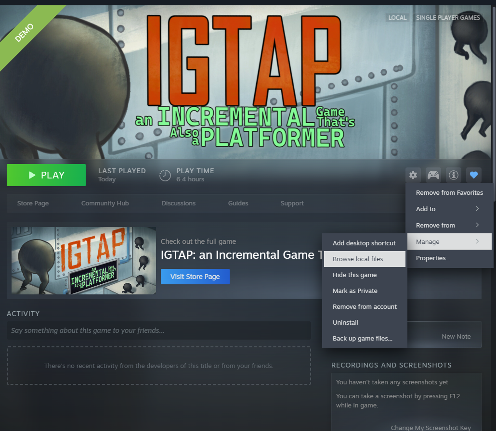
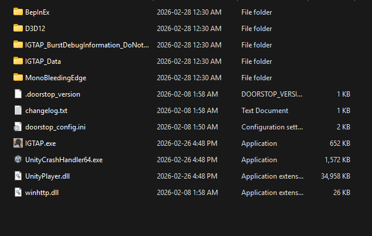

# TAS BepInEx Plugin for IGTAP

Tool-Assisted Speedrun (TAS) plugin for **IGTAP — *An Incremental Game That’s Also a Platformer***.

---

## Requirements

* **BepInEx 5.4.23.5 (x64)**
  https://github.com/BepInEx/BepInEx/releases/tag/v5.4.23.5

* Plugin download:
  https://github.com/pseudo-psychic/IGTAS/releases/

Tested on **March 1, 2026**.

---

## Installation

### 1️⃣ Install BepInEx

Download:

```
BepInEx_win_x64_5.4.23.5.zip
```

Open Steam → **IGTAP Demo**

Click:

```
Manage → Browse local files
```

#### Example (Steam menu)



---

Open the BepInEx zip and **copy ALL contents** into the game directory
(the folder containing `IGTAP.exe`).

#### Files inside the BepInEx archive


---

### 2️⃣ Generate BepInEx Folders

1. Run the game once using `IGTAP.exe`
2. Close the game

This automatically creates:

```
BepInEx/plugins
```

---

### 3️⃣ Install the TAS Plugin

1. Download the plugin `.dll` from Releases.
2. Place the file into:

```
BepInEx/plugins
```

---

### 4️⃣ Run the Game

Launch the game normally through Steam or the executable.

The plugin loads automatically.

---

## ✅ Final Folder Structure

Your game folder should look similar to this:

```
IGTAP/
│
├── BepInEx/
├── D3D12/
├── IGTAP_Data/
├── MonoBleedingEdge/
│
├── .doorstop_version
├── doorstop_config.ini
├── winhttp.dll
│
├── IGTAP.exe
├── UnityPlayer.dll
└── UnityCrashHandler64.exe
```

#### Example completed install



---

## Usage

**Input:** Keyboard only

### Recording Controls

| Key | Action                    |
| --- | ------------------------- |
| F6  | Start recording           |
| F7  | Stop recording / playback |
| F8  | Start playback            |

---

### Editor Controls

| Key   | Action       |
| ----- | ------------ |
| F9    | Open editor  |
| F10   | Add frame    |
| F11   | Remove frame |
| ← / → | Select frame |

---

## Known Issues

* Movement TAS is **fixed-physics dependent**
* Jump height is **framerate dependent**
* Trying to playback with a **controller plugged in** can cause problems (the TAS currently supports **keyboard only**)

### Controller Fix

If playback does not work:

1. Unplug the controller
2. Move around in-game using the keyboard for a moment (this resets input to keyboard)
3. Start playback again

---

## Troubleshooting

**Plugin not loading?**

Check:

* `BepInEx` folder exists beside `IGTAP.exe`
* `winhttp.dll` is present
* Plugin `.dll` is inside `BepInEx/plugins`
* Game was launched once after installing BepInEx

If BepInEx installed correctly, a console window should appear when the game starts.

---

## License

See repository license for details.
